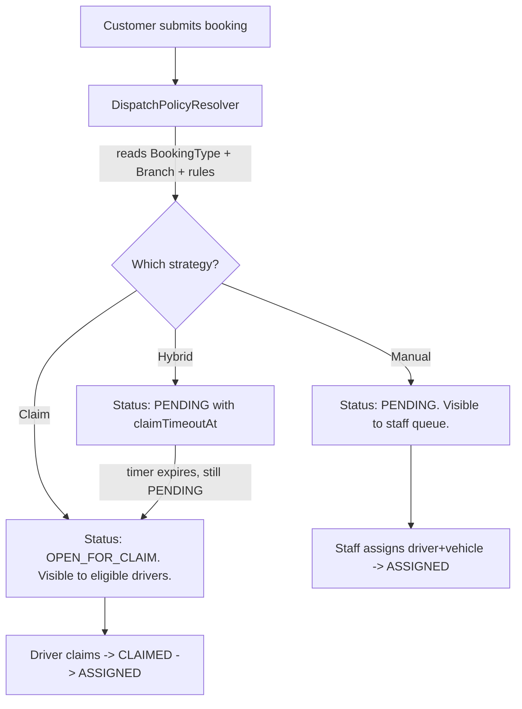
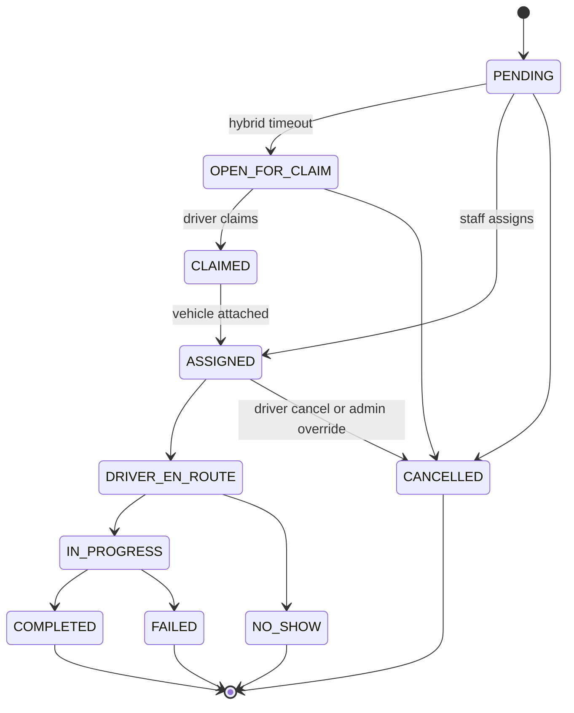

# CabFleet Implementation Plan

## 0. Decisions Already Locked In

- **Tenancy**: Single org MVP. `branchId` on every tenant-scoped table from v1. Future `orgId` will be added by migration only on shared tables — `branchId` shields most of them.
- **Customer auth**: Required Supabase accounts (email/password + phone OTP both enabled).
- **Project state**: Cleanup is complete. Admin shell, sidebar nav, and module placeholders exist at `[src/app/(admin)/](src/app/(admin)/)` and `[src/modules/](src/modules/)`. No Prisma, Supabase client, or auth wiring yet.

---

## 1. System Architecture

### 1.1 Monolith, not microservices

One Next.js 15 app deployed to Vercel. All four portals (admin, staff, driver, customer) live in the same project, separated by App Router route groups and a single RBAC middleware. Prisma talks to a single Supabase Postgres database. Supabase Auth handles identity.

Why: 4 roles + ~12 entities + 1 team. Microservices are pure cost here. A monolith with clear module boundaries is the correct shape until you have multiple teams or a hot service that needs independent scaling.

### 1.2 Frontend / backend boundary

- **Default to React Server Components + Server Actions** for all internal portal mutations. Co-located, typed end-to-end, no API boilerplate.
- **Route Handlers (`route.ts`) only for**: webhooks (Supabase auth, Stripe later), public health checks, the future mobile/driver app REST surface, and file upload signing.
- **No tRPC**. Server Actions already give you the same DX with less infra. Adopting tRPC later is cheap if a mobile app forces it.

### 1.3 Multi-role routing

Four route groups under `src/app`, each with its own layout, sidebar, and middleware allow-list:

```
src/app/
├── (admin)/         → ADMIN | STAFF  (current layout)
├── (driver)/        → DRIVER         (mobile-friendly, slim chrome)
├── (customer)/      → CUSTOMER       (public landing + portal)
└── (auth)/          → unauthenticated (current full-width pages)
```

A single `middleware.ts` reads the Supabase session, fetches the role from a cached `Profile` row, and rejects mismatched routes. See section 3.

### 1.4 Dispatch architecture (the most important call in this doc)

Dispatch is **not** hard-coded into the booking module. It is a **strategy pattern** chosen at runtime per booking based on rules.



The resolver lives at `src/modules/dispatch/services/resolveDispatchPolicy.ts` and is the **only** place that decides which strategy a booking uses. Adding "airport rides always manual" is a row in `DispatchRule`, not a code change.

---

## 2. Database Design (Prisma)

### 2.1 Identity model

- Supabase Auth owns the `auth.users` table.
- A mirrored `Profile` table in our schema (1:1 with `auth.users.id`) carries role, branch, and app-level fields. Synced via a Supabase trigger on `auth.users` insert.
- `Profile.role` is the single source of truth for RBAC. Role-specific data lives in `Driver`, `Staff`, `Customer` extension tables, all FK-ing back to `Profile`.

Why this shape: keeps Supabase Auth clean (no app columns in `auth.users`), lets Prisma own everything app-side, and makes role changes a single UPDATE.

### 2.2 Core entities

```
Profile (id = auth.users.id, role, branchId, name, phone)
  ├── 1:1 Driver       (licenseNo, status, rating, currentVehicleId)
  ├── 1:1 Staff        (employeeId, designation, shiftPattern)
  └── 1:1 Customer     (address, defaultPickup, loyaltyTier)

Branch (id, name, timezone, dispatchDefaults Json)
BookingType (id, name, basePricingId, defaultDispatchMode)
  Examples: "Airport Transfer", "Local", "Corporate", "Outstation"

Vehicle (id, branchId, regNo, make, model, status, insuranceExpiry, fitnessExpiry)
VehicleAssignment (driverId, vehicleId, validFrom, validTo)   -- history

Booking (
  id, branchId, customerId, bookingTypeId,
  pickupAt, pickupAddress, dropAddress, distanceKm, passengers,
  status BookingStatus,
  dispatchMode DispatchMode,
  claimTimeoutAt, claimedAt, claimedByDriverId,
  assignedDriverId, assignedVehicleId, assignedAt, assignedByStaffId,
  fareEstimate, fareFinal,
  version Int @default(0)        -- optimistic locking for claims
  createdAt, updatedAt, deletedAt
)

AssignmentHistory (bookingId, driverId, vehicleId, action, byProfileId, at, reason)
AuditLog          (entity, entityId, action, diff Json, byProfileId, at)
DispatchRule      (priority, branchId?, bookingTypeId?, customerSegment?, mode DispatchMode, params Json)

PricingRule       (bookingTypeId, branchId?, baseFare, perKm, perMin, surgeJson, validFrom, validTo)
Payment           (bookingId, amount, method, status, txnRef, capturedAt)
Invoice           (bookingId, number, pdfUrl, issuedAt, dueAt, status)

Attendance        (profileId, date, checkIn, checkOut, status)
Shift             (profileId, startsAt, endsAt, branchId)
FuelLog           (vehicleId, driverId, litres, amount, odometer, at)
Expense           (profileId?, vehicleId?, category, amount, at, receiptUrl)
MaintenanceLog    (vehicleId, type, cost, odometer, at, nextDueOdometer)
```

### 2.3 Booking status enum + lifecycle



Transitions are enforced in **one** place: `src/modules/bookings/services/transitionBookingStatus.ts`. Every transition writes an `AuditLog` and (where relevant) `AssignmentHistory` row inside the same Prisma `$transaction`.

### 2.4 Driver claim concurrency

Use **Postgres advisory + row-level locking**, not application-level mutexes:

```sql
-- Inside a Prisma $transaction
SELECT id, status, version FROM "Booking"
  WHERE id = $1 AND status = 'OPEN_FOR_CLAIM'
  FOR UPDATE SKIP LOCKED;
```

Then update `status = 'CLAIMED'`, set `claimedByDriverId`, increment `version`, and insert `AssignmentHistory`. Second driver's transaction returns zero rows and gets a clean "already claimed" error.

Belt-and-braces: `Booking.version` increments on every transition; mutations use `WHERE id = ? AND version = ?` so even bypassed code paths can't silently overwrite.

### 2.5 Soft deletes

- Soft delete (`deletedAt`) on: `Booking`, `Vehicle`, `Driver`, `Customer`, `Staff`, `PricingRule`, `DispatchRule`.
- Hard delete on: `AuditLog`, `AssignmentHistory`, `Attendance`, `FuelLog` — these are immutable history.
- All queries go through repo helpers that add `deletedAt: null` by default.

---

## 3. Authentication + RBAC

### 3.1 Stack

- **Supabase Auth** with `@supabase/ssr` for Next.js 15 cookie-based sessions.
- **`middleware.ts`** at repo root: reads session, fetches cached `Profile.role` (5-min KV/edge cache or per-request DB), enforces route-group allow-lists.
- **Server-side guards**: every server action calls `requireRole(['ADMIN', 'STAFF'])` from `src/lib/auth/requireRole.ts`. Never trust the client.

### 3.2 Route protection map

- `(admin)/*` → ADMIN, STAFF
- `(admin)/settings/*`, `(admin)/staff/*`, user management → ADMIN only
- `(driver)/*` → DRIVER
- `(customer)/*` → CUSTOMER (or unauthenticated for landing/booking-start)
- `(auth)/*` → no session required

### 3.3 RBAC granularity

Two layers:

1. **Role check** for coarse routing (ADMIN/STAFF/DRIVER/CUSTOMER).
2. **Permission check** for fine actions (`booking.reassign`, `driver.verify`, `pricing.edit`). Centralized in `src/lib/auth/permissions.ts` as a `{role -> permission[]}` map. Cheap to evolve; no DB table needed until you have custom roles.

### 3.4 Admin impersonation

Build it now, even if hidden: a `ImpersonationSession` table + a "Login as" button for ADMIN. Stores `originalProfileId` so every audit log entry records both actor and impersonator. Saves immense debugging time later.

### 3.5 Mobile/driver auth

Drivers will eventually use a mobile app. Use **Supabase phone OTP** as the driver login method now (in the web driver portal). Same flow ports to React Native untouched.

---

## 4. Module Implementation Order

Order is chosen so that every module has its dependencies in place and nothing requires rework.

1. **Foundation**: Prisma + Supabase wiring, `Profile` sync trigger, middleware, RBAC helpers, role-aware layouts. Nothing else can ship without this.
2. **Branches + Settings**: One row to start, but `branchId` is required everywhere downstream.
3. **Users + Staff management**: Admin can create staff, drivers, customers. Needed before assignment.
4. **Vehicles** (CRUD + status + insurance/fitness expiry alerts).
5. **Drivers** (CRUD + verification + vehicle linkage). Depends on vehicles for assignment.
6. **Customers**: Admin-side view + customer self-signup. Needed to create bookings against a real customer.
7. **Booking — Manual dispatch only** (status: PENDING → ASSIGNED → IN_PROGRESS → COMPLETED). The "boring" path. Validates the entire booking lifecycle infra.
8. **Customer portal**: Booking form, history, invoice download. Reuses backend from step 7.
9. **Dispatch policy + Driver Claim**: Adds `OPEN_FOR_CLAIM`, hybrid timer, driver portal claim screen, the locked transaction. Now the strategy pattern earns its keep.
10. **Payments + Invoices** (manual entry first; gateway later).
11. **Attendance + Shifts + Fuel + Expenses** (staff portal). These are independent and parallelizable with step 10.
12. **Reports + Analytics** (lowest priority, depends on everything having real data).

Why this order: manual dispatch first proves the booking lifecycle without concurrency risk. Adding claim later is additive — only the resolver, one new status, and one new screen.

---

## 5. Feature Module Architecture

Standard shape for every module (already partially exists at `[src/modules/](src/modules/)`):

```
src/modules/<feature>/
├── actions/         server actions (mutations only; thin)
├── services/        business logic, transactions, calls Prisma
├── queries/         read-only Prisma calls (typed, reusable)
├── validators/      zod schemas; one per action
├── components/      module-specific UI (tables, forms, dialogs)
├── hooks/           client hooks (filters, optimistic UI)
├── types.ts         pure types (already exists)
└── permissions.ts   per-module permission constants
```

Rules:
- **Actions never contain logic**. They `requireRole`, `validate(zod)`, `call service`, `return result`. Trivially testable.
- **Services own transactions**. They never touch `req/res`. Portable to a future REST handler unchanged.
- **Queries are pure reads**, safe to call from RSC.
- **Cross-module calls go through services**, never direct Prisma calls into another module's tables, to keep module boundaries enforceable.

### Per-module summary

- **bookings**: lifecycle state machine, manual assign, reassign, cancel, override. Pages: `/bookings`, `/bookings/[id]`, `/bookings/new`.
- **dispatch**: resolver, rules CRUD (ADMIN), hybrid timer worker (Vercel Cron). No own pages outside settings.
- **vehicles**: CRUD, status, expiry alerts. Pages: `/vehicles`, `/vehicles/[id]`.
- **drivers**: CRUD, verification, vehicle assignment, claim history. Pages: `/drivers`, `/drivers/[id]`.
- **staff**: CRUD + shift assignment. Pages: `/staff`, `/staff/[id]`.
- **attendance**: check-in/out (driver + staff), reports. Pages: `/attendance`.
- **payments**: record payment, refund, link to booking. Pages: `/payments`.
- **invoices**: generate (react-pdf or server-side), email, download. Pages: `/invoices`.
- **pricing** (new): rules CRUD, fare calculator service used by booking. Pages: `/settings/pricing`.
- **customers**: admin-side directory + customer-facing portal feature module.
- **reports**: read-only aggregates over above. Pages: `/reports`.

---

## 6. Folder Structure

```
src/
├── app/
│   ├── (admin)/        existing
│   ├── (driver)/       new: layout + pages
│   ├── (customer)/     new: landing + portal pages
│   ├── (auth)/         existing signin/signup
│   └── api/            webhooks + future mobile REST
├── modules/            (shape per section 5)
│   ├── bookings/  vehicles/  drivers/  staff/
│   ├── attendance/  payments/  invoices/
│   ├── dispatch/  pricing/  customers/  reports/
├── components/         shared UI (existing ui/, common/, form/, tables/)
├── layout/             AppSidebar/AppHeader (existing)
├── lib/
│   ├── db.ts           Prisma singleton
│   ├── supabase/       server.ts, client.ts, middleware.ts
│   ├── auth/           requireRole, permissions, session helpers
│   ├── errors/         AppError, error mapping
│   ├── logger.ts       pino, structured
│   └── utils/          formatters, date, money
├── hooks/              existing (useModal, useGoBack)
├── context/            existing (Sidebar, Theme)
├── types/              global shared types (Result<T>, PaginatedResponse<T>)
└── middleware.ts       single root middleware

prisma/
├── schema.prisma
├── migrations/
└── seed.ts
```

---

## 7. UI/UX Strategy

- **Admin/Staff**: keep the current TailAdmin chrome (`[src/app/(admin)/layout.tsx](src/app/(admin)/layout.tsx)`, `[src/layout/AppSidebar.tsx](src/layout/AppSidebar.tsx)`). It is already production-grade. Standardize on shadcn/ui for new components (Dialog, Table, Form, Select, Toast). Keep existing TailAdmin tables/forms — do not rewrite them.
- **Driver portal**: minimal one-column mobile-first layout. Big touch targets. Bottom nav: "Open Trips", "My Trips", "Profile". Built mobile-first because drivers will use it from phones from day one.
- **Customer portal**: full marketing landing → auth → booking form (multi-step) → "My Bookings". Use shadcn primitives; don't reuse the admin shell.
- **Tables**: a single `<DataTable>` wrapper around shadcn's table that takes columns + a server-side `fetcher`. Built once; reused everywhere. Server pagination + search.
- **Forms**: `react-hook-form` + `zod` + a shared `<FormField>` wrapper. The same `zod` schema used in the server action.
- **Status badges**: one `<BookingStatusBadge>` component that maps every enum value to a color. Single import everywhere.
- **Notifications**: `sonner` for toasts. Email/SMS via Supabase Edge Functions or Resend in Phase 5. WhatsApp is a Phase 6+ integration.

---

## 8. State Management

- **Server state by default**: RSC + Server Actions + `revalidatePath`. This covers 90% of pages.
- **TanStack Query** only where you need polling, infinite scroll, or aggressive optimistic UI — namely the driver "Open Trips" screen and the admin booking queue. Don't sprinkle it elsewhere.
- **Zustand**: not needed for MVP. The two existing React Contexts (`SidebarContext`, `ThemeContext`) cover UI state. Re-evaluate only if a feature demands cross-tree client state.
- **Forms**: `react-hook-form` + `@hookform/resolvers/zod`. Server actions receive `FormData` or typed object, re-validate with the same schema.
- **URL state**: `nuqs` for filter/search/pagination state on tables. Survives refresh, shareable, no extra store.

---

## 9. Scalability Considerations

- **Mobile**: keep services pure (no `next/headers` calls). When mobile lands, add `app/api/v1/*` route handlers that wrap the same services. Auth via Supabase JWT in `Authorization` header.
- **Realtime tracking**: Supabase Realtime channel on `Booking` row changes is enough for v1 of "driver moved to IN_PROGRESS, refresh customer screen". Actual GPS tracking is a separate `TripLocation` table + Supabase Realtime — Phase 7+.
- **WhatsApp**: Twilio or Meta Cloud API behind a `NotificationService` interface. The same interface that handles email today.
- **Payment gateway**: behind a `PaymentProvider` interface. Stripe / Razorpay / cash all implement it. MVP ships with `ManualPaymentProvider` only.
- **Multi-branch**: shipping in v1 schema. UI scoping (admin sees their branch only) added when there's a second branch.
- **Multi-tenant SaaS**: add `orgId` column to `Branch`, `Profile`, and a few shared tables in one migration. RLS policies (Supabase) layered on top. Defer until there's a paying second tenant.
- **Dispatch scaling**: when claim throughput becomes high, move the hybrid-timer worker from Vercel Cron to a queue (Inngest or Supabase Cron + a worker function). The strategy pattern means zero refactor in the feature code.

---

## 10. DevOps + Deployment

- **Env strategy**: `.env.local` (dev), Vercel env per environment (preview/production). `T3-env` (`@t3-oss/env-nextjs`) for typed, validated env access — fails fast on missing keys.
- **Two Supabase projects**: `cabfleet-dev` and `cabfleet-prod`. Preview deploys point at dev. No staging until needed.
- **Migrations**: `prisma migrate dev` locally, `prisma migrate deploy` in CI on merge to `main`. Never edit applied migrations.
- **CI**: GitHub Actions — `lint`, `typecheck`, `prisma validate`, `vitest`, `next build`. ~3 minutes. Block PRs on failure.
- **Vercel**: standard Next.js deploy. Pin Node 20. Image domains in `next.config.ts`. Edge runtime for `middleware.ts`, Node runtime everywhere else.
- **Backups**: Supabase Pro daily PITR + a weekly `pg_dump` to S3 via scheduled Edge Function. Test restore quarterly.

---

## 11. Security

- **Input validation**: every server action's first line is `schema.parse(input)`. No exceptions. Defense in depth even if the client also validates.
- **Authorization**: every server action's second line is `await requireRole([...])` or `await requirePermission(...)`. Tests assert this exists.
- **RLS**: enable Supabase RLS on tables exposed via the client SDK (none in MVP — Prisma talks server-side only). Add RLS before any client-direct read ever ships.
- **Rate limiting**: Upstash Redis + middleware for login, signup, booking create, and driver claim endpoints. Claim endpoint additionally throttled per-driver.
- **File uploads** (trip proof, receipts): Supabase Storage with signed URLs. MIME type and size validated server-side. Virus scanning deferred.
- **Role escalation**: `Profile.role` mutations restricted to ADMIN and audited. Customers cannot set their own role on signup — server-side `Profile` insert always forces `'CUSTOMER'`.
- **Booking abuse**: per-customer daily booking cap (configurable). Phone OTP verification before first booking.
- **Driver claim race**: covered by `SELECT FOR UPDATE SKIP LOCKED` + `version` column (section 2.4). Loadtest this in Phase 4.
- **Secrets**: never client-bundled. `NEXT_PUBLIC_*` only for Supabase anon key.
- **MFA (roadmap, not yet implemented)**: Supabase Auth supports TOTP factors out of the box (`supabase.auth.mfa.enroll({ factorType: 'totp' })` + `challenge`/`verify`). Phase plan:
  1. Add an "Account security" section under each portal that lists enrolled factors and lets users enroll a TOTP factor.
  2. After enrollment, gate ADMIN/STAFF login by checking `factors` on the session and prompting for the second factor before issuing the role-scoped redirect.
  3. Surface enforcement policy (mandatory for ADMIN/STAFF, optional for CUSTOMER/DRIVER) in `requireRole` so unenrolled privileged users are forced through enrollment.
  4. Audit all enroll/unenroll/verify events via `writeAudit`.
- **Security headers**: HSTS + X-Content-Type-Options + X-Frame-Options + Referrer-Policy + Permissions-Policy + CSP (report-only at first) are set in `next.config.ts`.
- **Error sanitization**: `toAppErrorPayload` returns a fixed generic message for non-`AppError` throws; real errors are logged server-side only.

---

## 12. Code Quality Standards

- **TypeScript**: `strict: true` already on. No `any`. `unknown` + narrow.
- **Naming**: `PascalCase` types, `camelCase` functions/vars, `kebab-case` file names except React components (`PascalCase.tsx`). Module folders are `kebab-case` (already correct).
- **Service pattern**: every service function returns a `Result<T>` discriminated union (`{ok: true, data} | {ok: false, error}`). Actions translate to throws or toast errors. Avoids try/catch noise.
- **Errors**: one `AppError` class with `code`, `message`, `cause`. Mapped to user-friendly strings at the action boundary.
- **Logging**: `pino` with request-scoped child logger. Log every dispatch decision, every booking transition, every auth event.
- **Testing pyramid**:
  - **Unit (vitest)**: services, validators, the dispatch resolver, the status state machine. Aim for coverage on logic-heavy modules only.
  - **Integration (vitest + a test Postgres)**: actions end-to-end against a real DB.
  - **E2E (Playwright)**: 5–10 happy-path flows only — login per role, create booking, assign, claim, complete, cancel. Don't chase coverage.
- **Cursor optimization**: keep files small (<300 lines), one export per file where reasonable, JSDoc on every exported service function, an `AGENTS.md` at repo root describing the module shape. This is what makes AI edits reliable.

---

## 13. Development Roadmap

### Phase 0 — Foundation (1 week)
**Goal**: nothing visible; everything underneath ready.
- Add Prisma, init schema with `Profile`, `Branch`, base enums.
- Wire `@supabase/ssr`, `lib/supabase/*`, `lib/db.ts`.
- Supabase trigger: `auth.users insert → Profile insert`.
- Root `middleware.ts` + `requireRole` + permission map.
- Add `(driver)` and `(customer)` route groups with empty layouts.
- T3-env, sonner, shadcn init, react-hook-form, zod, vitest, playwright skeleton.
- CI pipeline live.
**Risk**: Supabase + Prisma cohabitation. **Mitigation**: keep all RLS off in MVP; Prisma is the only writer.
**Deliverable**: deploy preview where you can sign up, see role-correct shell, and nothing else.

### Phase 1 — Admin Core (1.5 weeks)
**Goal**: admin can manage the operational entities.
- Branches + Settings page.
- Vehicles, Drivers, Staff CRUD with `<DataTable>` and shared form patterns.
- Customer admin-side directory.
- Audit log writes wired into every mutation.
**Dependencies**: Phase 0.
**Deliverable**: a fully usable admin back-office for static data.

### Phase 2 — Booking Lifecycle (Manual) (2 weeks)
**Goal**: end-to-end manual booking from staff perspective.
- Booking schema + status state machine + `transitionBookingStatus` service.
- Staff-side booking create, assign driver+vehicle, status transitions.
- `AssignmentHistory` writes.
- Booking detail page with timeline.
- PricingRule + fare calculator (used at creation).
**Risk**: state machine complexity creep. **Mitigation**: lock the enum in Phase 1; one file owns transitions.
**Deliverable**: a staffer can run an entire booking lifecycle manually.

### Phase 3 — Customer Portal (1 week)
**Goal**: customers can self-serve.
- Landing page, customer signup/login, profile.
- Booking creation form (multi-step, mobile-first).
- "My Bookings" + status view + invoice download stub.
**Dependencies**: Phase 2.
**Deliverable**: a real user can book without staff intervention; staff still assigns manually.

### Phase 4 — Dispatch + Driver Claim (1.5 weeks)
**Goal**: drivers can claim bookings; hybrid mode works.
- `(driver)` portal: open trips, my trips, claim action, status updates.
- `DispatchRule` table + admin UI in Settings.
- `resolveDispatchPolicy` service.
- Claim transaction with `SELECT FOR UPDATE SKIP LOCKED` + `version`.
- Vercel Cron worker for hybrid-mode timeout promotion.
- Concurrency load test (k6 or hand-rolled) before merge.
**Risk**: race conditions. **Mitigation**: the load test is non-negotiable; failing builds block release.
**Deliverable**: a booking can flow through all three dispatch modes.

### Phase 5 — Payments + Invoices (1 week)
**Goal**: revenue is recorded and customers get documents.
- Payment record CRUD, link to booking.
- Invoice generation (server-side PDF via `@react-pdf/renderer`), upload to Supabase Storage, signed URL.
- Email send via Resend.
- Payment gateway abstraction in place; only manual provider implemented.
**Deliverable**: a complete operational money loop.

### Phase 6 — Staff Ops + Reports + Polish (1.5 weeks)
**Goal**: complete the operational picture.
- Attendance, Shifts, FuelLog, Expense, MaintenanceLog.
- Driver mobile attendance from `(driver)` portal.
- Reports page with key aggregates (revenue, trips, driver utilization, vehicle utilization).
- Bug burn-down, accessibility pass, perf pass.
**Deliverable**: v1.0.

### Phase 7+ (Post-MVP, demand-driven)
- WhatsApp notifications.
- Real payment gateway (Razorpay/Stripe).
- Realtime location tracking.
- Multi-org/SaaS (`orgId` migration + RLS).
- React Native driver app.

---

## 14. Tradeoffs Called Out

- **Prisma + Supabase together**: gives the best ORM DX but means we can't lean on RLS for security. Acceptable because everything goes through server actions; we'd need RLS anyway only if/when we add direct client → Supabase reads.
- **Server Actions over tRPC**: better DX today, but external clients (mobile) need a REST layer added later. Cost is small because services are already isolated.
- **Monolith routing**: all roles in one Next.js app means a bad deploy hits everyone. Mitigated by trunk-based dev + preview deploys + feature flags via env or a `FeatureFlag` table later.
- **Single Postgres**: cheaper and simpler. If a single table becomes hot (`Booking` history at multi-tenant scale), Supabase read replicas first; sharding is years away.
- **Vercel Cron for hybrid timer**: 1-min granularity, free. If sub-second promotion is ever needed, switch to Inngest. No code change in the dispatch module — just the trigger source.
