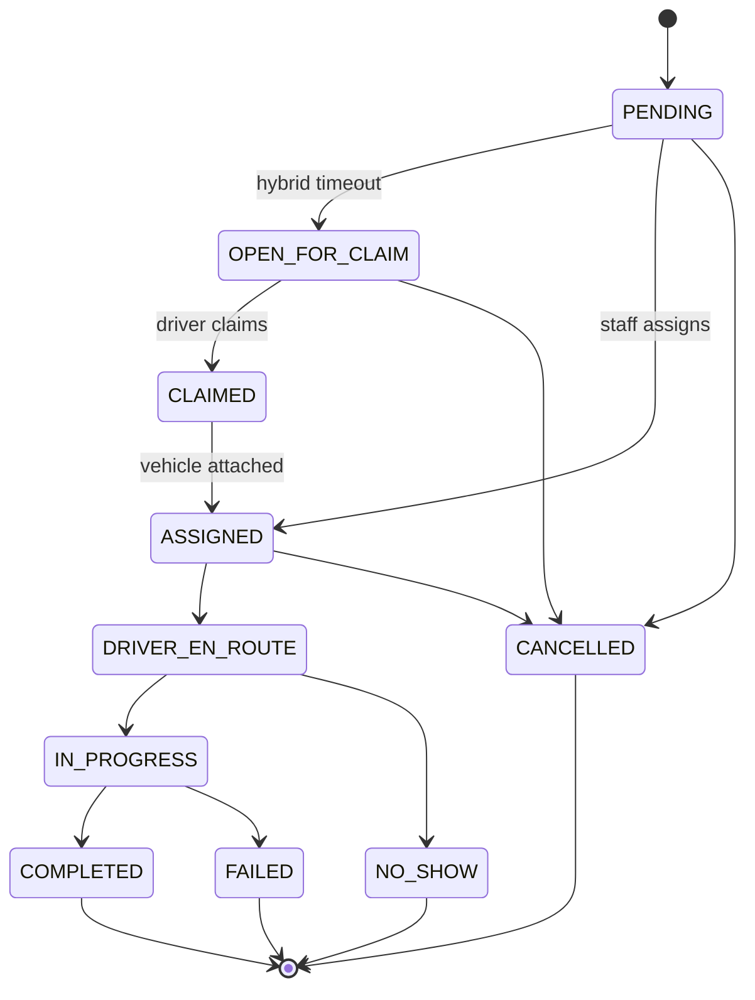
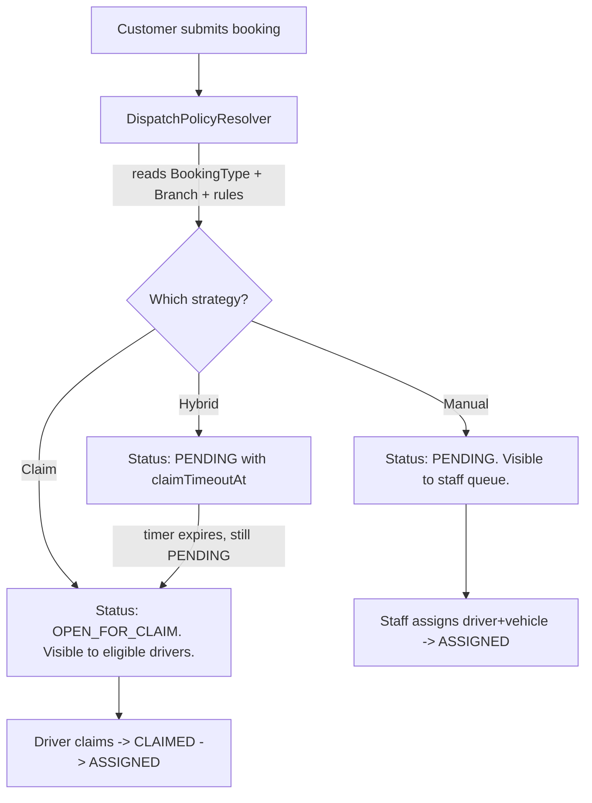

# CabFleet Architecture

CabFleet is a self-hostable cab dispatch platform: staff desk, customer portal, and driver portal in one Next.js monolith. The product is shipped and operational. UI chrome derives from TailAdmin (MIT); domain logic is CabFleet-specific.

## 1. System overview

### 1.1 Monolith

One Next.js 16 app on Vercel (or any Node 20 host). Four portals share a single Supabase Postgres database and Prisma 7 ORM. Supabase Auth handles identity. Prisma (with `@prisma/adapter-pg`) is the only writer.

### 1.2 Frontend / backend boundary

- **Default**: React Server Components + Server Actions for all internal portal mutations.
- **Route handlers** (`route.ts`): webhooks (Supabase auth, Razorpay), public health checks, REST v1 surface, file upload signing.
- **No tRPC**. Services are isolated so a REST layer can wrap them later.

### 1.3 Route groups

```
src/app/
├── page.tsx              → public landing (`/`)
├── setup/                → first-run install wizard (`/setup`)
├── (admin)/              → ADMIN | STAFF | SUPER_ADMIN  (desk at `/dashboard`)
├── (driver)/             → DRIVER
├── (customer)/           → CUSTOMER portal (`/portal`)
└── (full-width-pages)/   → unauthenticated auth screens
```

`middleware.ts` treats `/` as public by exact match. Signed-in visitors to `/` redirect to `getRoleHome(role)`.

### 1.4 Install settings

Country, currency, locale, timezone, and phone region are **install-scoped**, not per-organization. A singleton `InstallSettings` row (`id = "default"`) is created by the `/setup` wizard on first run. All formatters and phone helpers read from `InstallSettings` — never hardcode `en-IN`, `INR`, or `toE164` default `"IN"` in feature code.

Module: `src/modules/install/` (`actions/`, `services/`, `queries/`, `validators/`, `components/SetupWizard.tsx`).

## 2. Database

### 2.1 Identity

- Supabase Auth owns `auth.users`.
- `Profile` table (1:1 with `auth.users.id`) carries role, branch, and app fields. Synced via `prisma/sql/01_profile_sync.sql` trigger.
- Role-specific data in `Driver`, `Staff`, `Customer` extension tables.

### 2.2 Core entities

`Branch`, `Vehicle`, `Driver`, `Staff`, `Customer`, `Booking`, `BookingType`, `AssignmentHistory`, `AuditLog`, `DispatchRule`, `PricingRule`, `Payment`, `Invoice`, `Attendance`, `Shift`, `FuelLog`, `Expense`, `MaintenanceLog`, `InstallSettings`.

`branchId` scopes tenant data. Soft deletes (`deletedAt`) on operational entities; immutable history tables are hard-deleted never.

### 2.3 Booking lifecycle

Every status change goes through **one function**: `src/modules/bookings/services/transitionBookingStatus.ts`. Never `db.booking.update({ status })` elsewhere.



The transition function:

1. Loads the current booking with `version`.
2. Validates the proposed transition against an allow-list per current status.
3. Opens a transaction.
4. Updates booking with `where: { id, version }` (optimistic lock), increments `version`.
5. Writes `AssignmentHistory` if driver/vehicle changed.
6. Writes `AuditLog`.
7. Returns `Result<Booking>`.

### 2.4 Driver claim concurrency

`SELECT FOR UPDATE SKIP LOCKED` inside `db.$transaction` against `OPEN_FOR_CLAIM` bookings. `Booking.version` is the optimistic-lock backstop. Both are required.

### 2.5 Dispatch strategy

Dispatch is a **strategy pattern** chosen at runtime per booking:



Resolver: `src/modules/dispatch/services/resolveDispatchPolicy.ts`.

## 3. Authentication and RBAC

### 3.1 Stack

- Supabase Auth with `@supabase/ssr` cookie sessions.
- `middleware.ts`: session + `Profile.role` enforcement per route group.
- Every server action calls `requireRole([...])` or `requirePermission(...)` first.

### 3.2 Staff MFA (AAL2)

Staff and admin routes require authenticator assurance level 2 (`aal2`). `src/lib/auth/aal.ts` checks the session; unenrolled staff are prompted to enroll TOTP via `MfaSettingsPanel`. MFA enroll/verify events are audited.

### 3.3 Route protection

| Route group | Roles |
|---|---|
| `(admin)/*` | ADMIN, STAFF, SUPER_ADMIN |
| `(admin)/settings/*`, user management | ADMIN, SUPER_ADMIN |
| `(driver)/*` | DRIVER |
| `(customer)/*` | CUSTOMER |
| `(full-width-pages)/*` | unauthenticated |

Fine-grained permissions in `src/lib/auth/permissions.ts`.

## 4. Payments and invoices

- **Manual payments**: staff record cash/card payments against bookings.
- **Razorpay**: optional online checkout when `InstallSettings.country === "IN"`. Disabled for all other countries.
- **Invoices**: server-side PDF via `@react-pdf/renderer`, uploaded to Supabase Storage. Tax ID label comes from `InstallSettings.taxIdLabel`; value from `Organization.gstin`.

## 5. Module layout

Every feature follows:

```
src/modules/<feature>/
  actions/         Server actions. Thin: requireRole -> validate -> service -> Result.
  services/        Pure business logic. Owns transactions. Returns Result<T>.
  queries/         Read-only DB calls. Safe to call from RSC.
  validators/      zod schemas. One per action.
  components/      Module-specific UI.
  hooks/           Client hooks (filters, optimistic UI).
```

Rules:

- Actions never contain business logic.
- Services never touch `req/res`, `cookies()`, or `next/headers`.
- Cross-module access goes through the other module's `services/` or `queries/`.
- Every mutation writes an `AuditLog` row inside the same `db.$transaction`.

## 6. UI and theming

Admin/staff chrome uses TailAdmin-derived layout (`src/app/(admin)/layout.tsx`, `src/layout/AppSidebar.tsx`). Feature code uses **semantic tokens only** — no raw palette colors or arbitrary Tailwind values in `src/app/**` or `src/modules/**`. Status UI uses `<StatusBadge tone={...}>`. Full reference: [docs/ui-styling.md](ui-styling.md).

Driver portal: mobile-first, bottom nav. Customer portal: marketing landing → auth → booking form. Neither reuses the admin shell.

## 7. Security

- **Input validation**: every server action validates with zod first.
- **Authorization**: `requireRole` / `requirePermission` on every action.
- **RLS**: all tables have `ENABLE ROW LEVEL SECURITY` + `deny_direct_api_access` restrictive policy. Prisma (superuser) is the only writer; PostgREST direct access is blocked. See [docs/security/rls-lockdown.md](security/rls-lockdown.md).
- **Rate limiting**: Upstash Redis on login, signup, booking create, and claim endpoints.
- **CSP**: content security policy in `next.config.ts` (report-only in dev, enforced in production).
- **Secrets**: never client-bundled. `NEXT_PUBLIC_*` only for Supabase anon key.

## 8. State management

- Server state: RSC + Server Actions + `revalidatePath`.
- URL state: `nuqs` for table filters/pagination.
- Forms: `react-hook-form` + zod (same schema as server action).
- No Zustand, Redux, or React Context for domain state.

## 9. DevOps

- **Env**: typed via `src/lib/env.ts` (`@t3-oss/env-nextjs`). Never read `process.env` in app code.
- **Migrations**: `prisma migrate dev` locally, `prisma migrate deploy` in CI.
- **CI**: GitHub Actions — `lint`, `typecheck`, `vitest`, `check:tokens`, `check:structure`, `next build`, Playwright (landing + CSP).
- **Node**: 20. `npm ci --legacy-peer-deps` (`nuqs` stale peer dep).

## 10. Folder structure

```
src/
├── app/              route groups + pages
├── modules/          domain features (bookings, dispatch, drivers, install, …)
├── components/       shared UI (ui/, common/, form/)
├── layout/           AppSidebar, AppHeader
├── lib/              db, supabase, auth, env, audit, result, logger
└── middleware.ts

prisma/
├── schema.prisma
├── migrations/
├── sql/              RLS lockdown, profile sync
└── seed.ts
```

Agent conventions for contributors and AI-assisted edits: [AGENTS.md](../AGENTS.md).
